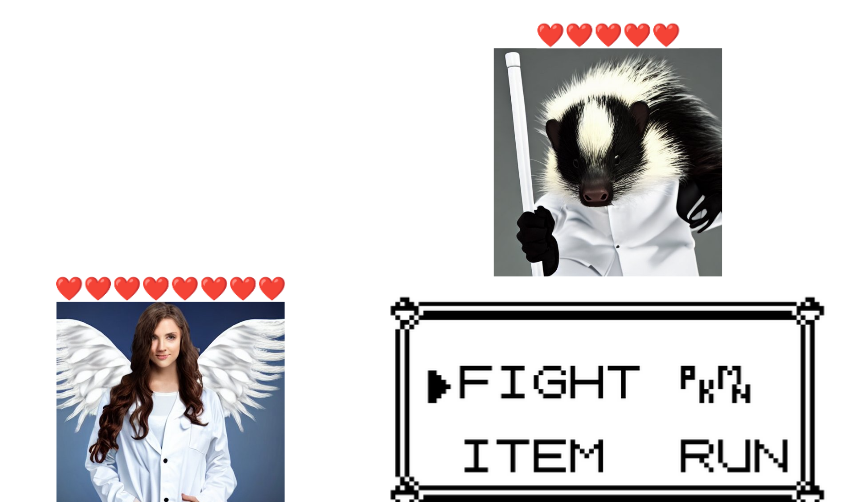

# Scifighter

This package is the result of me experimenting with R packages during the "Reproducible Research with R Packages" course provided by the eScience Center Digital Skills Programme.

Scifighter is a science battle game which runs inside your IDE (rstudio) inspired by pokemon. 



## Install

This is an *R* package. [*R*](https://www.r-project.org/) is required, [*RStudio*](https://www.rstudio.com/) is recommended. The easiest way to install this package is to install it using devtools. If you don't already have devtools installed run:

``` r
install.packages("devtools")  
devtools::install_github("J-PTRson/Scifighter")
```

After installing, attach the package in r using:

``` r
library(Scifighter)
```

Now you are ready to go!

## Basic usage

Once you have loaded the library run the following command to start the game:

``` r
gamestart()
```

If you're having audio issues, then you can disable sound using:

```r
gamestart(nosound=TRUE)
```


Have fun!
